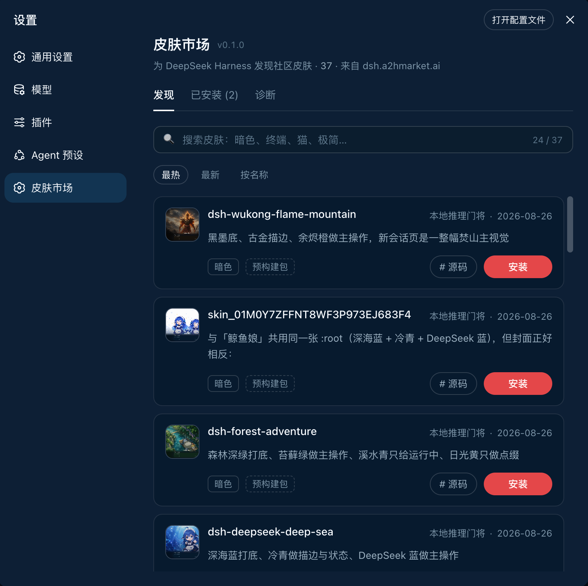
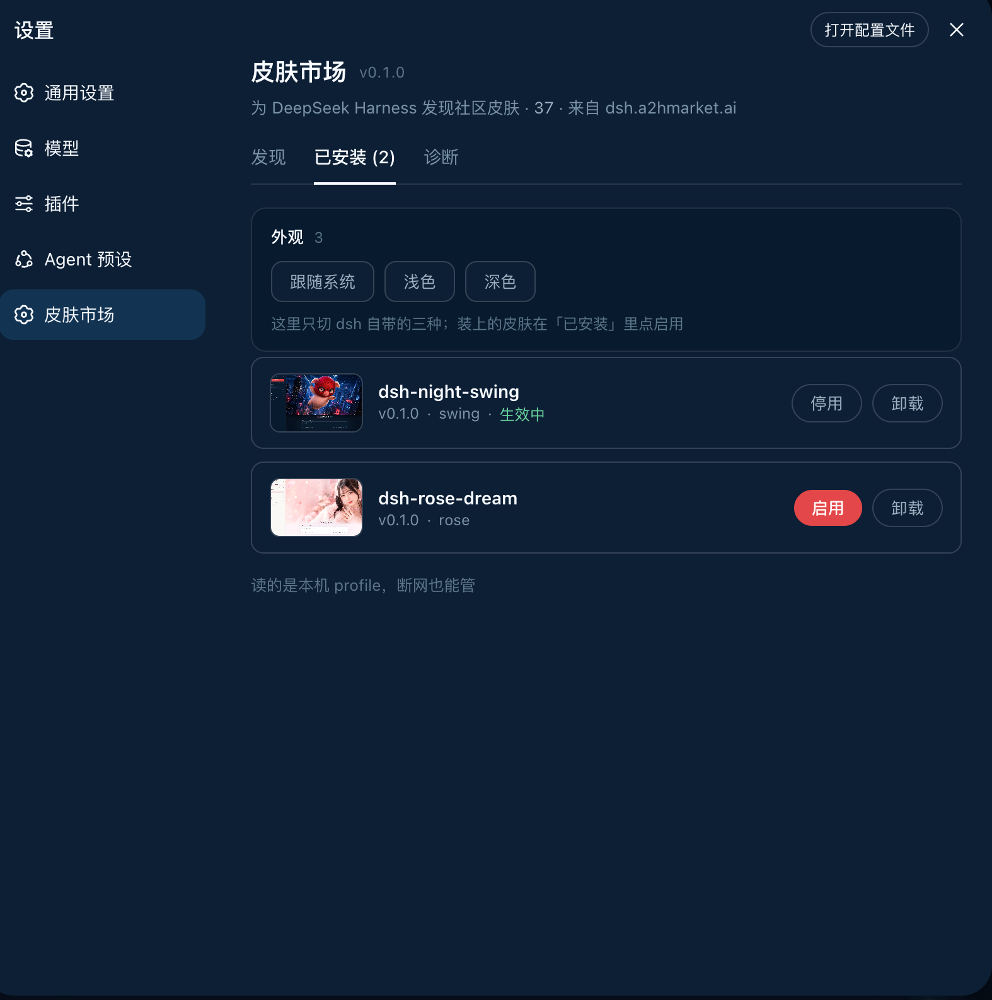

<h1 align="center">DSH Skin Market</h1>

<p align="center">
  <strong>Search for skins inside <a href="https://github.com/deepseek-ai/deepseek-harness">DeepSeek Harness</a> and install them with one click.</strong><br>
  Install it once, and changing skins never sends you back to the terminal.
</p>

<p align="center">
  <a href="https://dsh.a2hmarket.ai"><strong>dsh.a2hmarket.ai</strong></a>
  — where the skin catalog comes from, no login required
</p>

<p align="center">
  <a href="https://github.com/keman-ai/dsh-skin-market"></a>
  <a href="https://github.com/keman-ai/dsh-skin-market/releases"></a>
  <a href="LICENSE"></a>
</p>

<p align="center">
  <b>English</b> · <a href="README.zh-CN.md">简体中文</a>
</p>

<p align="center">
  <b>If this is useful to you, a Star goes a long way</b>
</p>

## Three tabs

<table>
  <tr>
    <td width="50%" valign="top">
      
    </td>
    <td width="50%" valign="top">
      
    </td>
  </tr>
  <tr>
    <td valign="top">
      <h3>Discover</h3>
      <p>Search, sort, install in one click. Each card states whether the skin is a <strong>prebuilt package</strong> or <strong>built from source</strong> — so you know whether the click costs seconds or minutes before you make it.</p>
    </td>
    <td valign="top">
      <h3>Installed</h3>
      <p>Version, theme id, <strong>enable / disable</strong>, uninstall. It reads the local profile, so it <strong>works offline</strong> — even the previews are served locally, with no extra network use.</p>
    </td>
  </tr>
</table>

<p align="center">
  <sub><b>Diagnostics</b>　·　pnpm, the profile path, registry connectivity and the full output of the last install — the first screen to check when something will not install, and far more useful than a screenshot</sub>
</p>

> **The source of every official skin on the site lives in [dsh-skin-pack](https://github.com/keman-ai/dsh-skin-pack).**

## Install

```sh
dsh plugin --profile web add -w github:keman-ai/dsh-skin-market
```

Restart dsh once, then open **Settings → Skin Market**.

```sh
dsh --profile web
```

**From then on, installing a skin only takes a page refresh — no restart, no commands.**

> **`-w` is not optional.** The profile directory ships a `pnpm-workspace.yaml`, so pnpm reads it as a workspace root and refuses to install (`ERR_PNPM_ADDING_TO_ROOT`). `-w` is the "yes, install into the root" declaration, and `dsh plugin` forwards it to pnpm verbatim. Both pnpm 8 and 10 need it.

The repository ships its build output (`lib/`) and has no `prepare` script, so pnpm runs no build script when installing from a git source and you never have to grant `allowBuilds`.

If you run harness from source, replace both `dsh` commands above with `pnpm dsh` inside the harness directory.

### Uninstall

```sh
dsh plugin --profile web remove dsh-skin-market
```

Skins installed through the market do not disappear with it — they are independent dependencies in the profile, uninstalled individually from the market's Installed tab.

## Requirements

**Browsing** needs only dsh and a network. **Installing** is what needs the command-line tools, because installing is fundamentally running `pnpm` on your behalf.

| Dependency | Requirement | What happens without it |
|---|---|---|
| **DeepSeek Harness** | `0.1.0-rc.6+` (tested on rc.7) | Earlier versions lack `settings.section` and the browser module table, so the plugin cannot mount |
| **profile** | Must be the **web** profile | headless / tui bundles have no `webServer`, so the plugin never activates |
| **Node.js** | `>= 20` (tested on 24) | dsh's own requirement; the plugin does not raise it |
| **pnpm** | On `PATH` (tested on 8.15 and 10) | Affects installing only. Diagnostics flags it red and the install button reports a clear error, while browsing and search continue |
| **git** | Only for GitHub-source skins | Most catalog skins now use Release tarballs (no git needed); only a few remain `github:owner/repo` sources |
| **Network** | `dsh.a2hmarket.ai`; also `github.com` for GitHub-source skins | An unreachable registry falls back to the cache or bundled snapshot, and the page says so |
| **Browser** | Installing requires a **direct local connection** (loopback) | Remote access can browse and search; installing is refused |

The plugin itself has a single runtime dependency: [`yaml`](https://www.npmjs.com/package/yaml), used to read and write the profile's patch file.

## Configuration

No configuration is needed by default. To change something, append a section to the profile's `cordis.patch.yml` (`$DSH_HOME/profiles/web/cordis.patch.yml`) overriding this plugin's row by id:

```yaml
- id: skin-market
  name: dsh-skin-market
  config:
    # Point at a different registry (for a self-hosted catalog). Include the context path.
    catalogOrigin: https://dsh.a2hmarket.ai/dsh-skin
    # Turn this off for a read-only market: browsing and search work, and the install
    # button no longer touches your machine.
    allowInstall: true
```

## Development

```sh
pnpm install
pnpm build     # → lib/index.js (host half) + lib/client.js (browser half)
pnpm check     # type check
pnpm test      # unit tests
```

After changing code, run `pnpm build` again and restart dsh. When the plugin is installed into a profile with `link:`, there is no need to `add` it again.

**`lib/` is committed on purpose**: pnpm does not run build scripts for git sources by default, so a package without build output is missing its entry file and stops dsh from starting. Commit the `pnpm build` output along with your code changes.

### The two halves

| | File | Responsibility |
|---|---|---|
| host | `src/index.ts` | Mounts `/skin-market/api/*` on `ctx.webServer`: catalog proxy and cache, installed list, install/uninstall (streaming pnpm output over SSE), diagnostics |
| client | `src/client/index.ts` | Registers `settings.section`, renders the list, search and install interactions |

The two halves talk over **same-origin HTTP** rather than `ctx.remote` — the remote capability set is fixed at `api-remotes` build time and third-party plugins cannot add to it.

`lib/client.js` is CJS in closure-factory form (`window.__ModuleLoader__.load({ id, factory })`); external dependencies such as React come from the host-injected `require` via the module table and are not bundled. That shape is dictated by dsh's module table, and `tsdown.config.ts` reproduces it.

### Harness types

`types/dsh.d.ts` vendors the parts of the harness API we use, transcribed from the 0.1.0-rc.7 source with the origin noted at each site — these modules are all external at runtime, and the `@deepseek-ai/dsh-client-*` dependency chain on npm is currently incomplete and cannot be installed. When host behaviour disagrees with the declarations, check that file first.

## Related

| | |
|---|---|
| [dsh.a2hmarket.ai](https://dsh.a2hmarket.ai) | The skin catalog site where authors publish. This plugin's catalog is fetched from it |
| [dsh-skin-pack](https://github.com/keman-ai/dsh-skin-pack) | The source of the official skins, all in one repository |

<p align="center">
  
</p>

## Star history

[](https://star-history.com/#keman-ai/dsh-skin-market&Date)

## License

[MIT](LICENSE) © 2026 Science Roam Limited

---

<p align="center">
  <sub>If this is useful to you, a Star goes a long way</sub>
</p>
