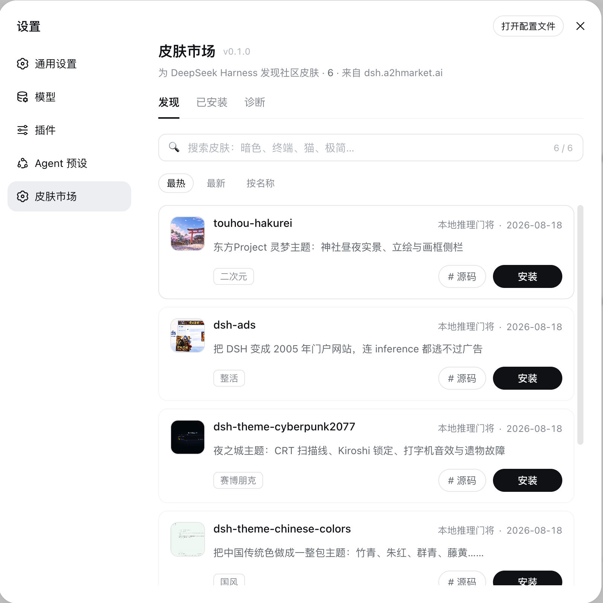
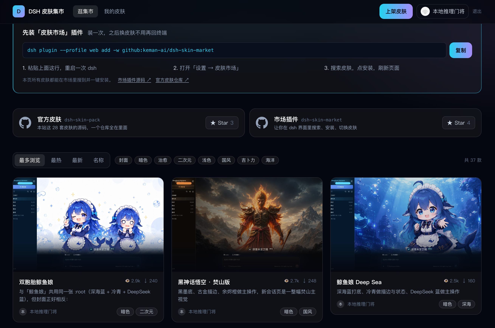

<h1 align="center">DSH Skin Market</h1>

<p align="center">
  <strong>在 <a href="https://github.com/deepseek-ai/deepseek-harness">DeepSeek Harness</a> 里搜皮肤、点一下装上。</strong><br>
  装一次，之后换皮肤不用再回终端。
</p>

<p align="center">
  <a href="https://dsh.a2hmarket.ai"><strong>dsh.a2hmarket.ai</strong></a>
  —— 皮肤目录来自这里，免登录
</p>

<p align="center">
  <a href="https://github.com/keman-ai/dsh-skin-market"></a>
  <a href="https://github.com/keman-ai/dsh-skin-market/releases"></a>
  <a href="LICENSE"></a>
</p>

<p align="center">
  <b>如果喜欢就给个 Star 鼓励我们一下吧</b>
</p>

<p align="center">
  
</p>

## 三个页签

<table>
  <tr>
    <td width="33%" valign="top">
      <h3>发现</h3>
      <p>搜索、排序、一键安装。卡片上标着这套皮肤是<strong>预构建包</strong>还是<strong>源码构建</strong>——点下去要等几秒还是几分钟，在点之前就知道。</p>
    </td>
    <td width="33%" valign="top">
      <h3>已安装</h3>
      <p>版本、来源、启用 / 停用、卸载。读的是本机 profile，<strong>断网也能管</strong>；预览图也走本地，不额外联网。</p>
    </td>
    <td width="33%" valign="top">
      <h3>诊断</h3>
      <p>pnpm、profile 路径、集市连通性、上次安装的完整输出。装不上时先看这一屏，比截图有用得多。</p>
    </td>
  </tr>
</table>

> **本站官方皮肤的源码都在 [dsh-skin-pack](https://github.com/keman-ai/dsh-skin-pack)。**

## 安装

```sh
dsh plugin --profile web add -w github:keman-ai/dsh-skin-market
```

重启一次 dsh，打开 **设置 → 皮肤市场**。

```sh
dsh --profile web
```

**此后装皮肤只要刷新页面，不用再重启，也不用再敲命令。**

> **`-w` 不能省。** profile 目录自带 `pnpm-workspace.yaml`，pnpm 因此认定它是 workspace 根并拒绝安装（`ERR_PNPM_ADDING_TO_ROOT`）。`-w` 就是「我确实要装到根」的声明；`dsh plugin` 会把它原样转发给 pnpm。pnpm 8 和 10 都需要。

仓库里带着构建产物（`lib/`），也没有 `prepare` 脚本，所以从 git 源安装时 pnpm 不需要执行任何构建脚本，你不必为它授权 `allowBuilds`。

从 harness 源码运行的话，把上面两条 `dsh` 换成在 harness 目录里跑 `pnpm dsh`。

### 卸载

```sh
dsh plugin --profile web remove dsh-skin-market
```

用市场装的皮肤不会跟着消失 —— 它们是 profile 里独立的依赖，在市场页的「已安装」里单独卸。

## 运行环境

**只逛**只要有 dsh 和网络。**要装皮肤**才需要那几个命令行工具，因为安装本质上就是替你跑 `pnpm`。

| 依赖 | 要求 | 少了会怎样 |
|---|---|---|
| **DeepSeek Harness** | `0.1.0-rc.6+`（实测 rc.7） | 更早的版本没有 `settings.section` 与浏览器模块表，插件挂不上 |
| **profile** | 必须是 **web** profile | headless / tui 组合里没有 `webServer`，插件不会激活 |
| **Node.js** | `>= 20`（实测 24） | dsh 自己的要求，插件不额外抬高 |
| **pnpm** | 在 `PATH` 上（实测 8.15 与 10） | 只影响安装。诊断页标红，安装按钮明确报错，浏览和搜索照常 |
| **git** | 装 GitHub 源皮肤才要 | 目录里多数皮肤已改用 Release tarball（不需要 git），只有少数仍是 `github:owner/repo` 源 |
| **网络** | `dsh.a2hmarket.ai`；装 GitHub 源皮肤还要 `github.com` | 集市连不上会回落到缓存 / 随包快照并在页面说明 |
| **浏览器** | 装皮肤要求**本机直连**（loopback） | 远程访问时能逛能搜，安装被拒 |

插件自身只有一个运行时依赖：[`yaml`](https://www.npmjs.com/package/yaml)，用来读写 profile 的 patch 文件。

## 配置

插件默认不需要配置。要改的话，在 profile 的 `cordis.patch.yml`（`$DSH_HOME/profiles/web/cordis.patch.yml`）里追加一段，按 id 覆盖本插件那一行：

```yaml
- id: skin-market
  name: dsh-skin-market
  config:
    # 换一个集市（自建目录服务时用）。注意要带 context-path。
    catalogOrigin: https://dsh.a2hmarket.ai/dsh-skin
    # 关掉后市场只读：能逛能搜，安装按钮不再动你的机器。
    allowInstall: true
```

## 开发

```sh
pnpm install
pnpm build     # → lib/index.js（host 半）+ lib/client.js（浏览器半）
pnpm check     # 类型检查
pnpm test      # 单元测试
```

改完代码重新 `pnpm build`，然后重启 dsh。插件以 `link:` 装进 profile 时不必重新 `add`。

**`lib/` 是故意提交进仓库的**：用户从 git 源安装时 pnpm 默认不执行构建脚本，不带产物的包会因缺入口文件让 dsh 起不来。所以改完代码要把 `pnpm build` 的产物一并提交。

### 两半

| | 文件 | 职责 |
|---|---|---|
| host | `src/index.ts` | 在 `ctx.webServer` 上挂 `/skin-market/api/*`：目录代理与缓存、已装清单、安装/卸载（SSE 回流 pnpm 输出）、诊断 |
| client | `src/client/index.ts` | 注册 `settings.section`，画列表、搜索、安装交互 |

两半之间走**同源 HTTP**，不走 `ctx.remote` —— remote 的能力集在 `api-remotes` 构建期就固定了，第三方插件加不进去。

`lib/client.js` 是闭包工厂形态的 CJS（`window.__ModuleLoader__.load({ id, factory })`），React 等外部依赖由宿主注入的 `require` 从模块表取，不打进包里。这个形状由 dsh 的模块表规定，`tsdown.config.ts` 复刻了它。

### harness 的类型

`types/dsh.d.ts` 自带了用到的那部分 harness API 声明，照 0.1.0-rc.7 的源码抄写，每处标了出处 —— 这些模块运行时全是 external，而 npm 上的 `@deepseek-ai/dsh-client-*` 依赖链目前不完整装不下来。宿主行为与声明对不上时，先回那个文件核对。

## 相关

| | |
|---|---|
| [dsh.a2hmarket.ai](https://dsh.a2hmarket.ai) | 皮肤目录站，作者在这里上架。本插件的目录就是从这里拉的 |
| [dsh-skin-pack](https://github.com/keman-ai/dsh-skin-pack) | 官方皮肤的源码，一个仓库全在里面 |

<p align="center">
  
</p>

## Star 趋势

[](https://star-history.com/#keman-ai/dsh-skin-market&Date)

## 许可

[MIT](LICENSE) © 2026 Science Roam Limited

---

<p align="center">
  <sub>如果喜欢就给个 Star 鼓励我们一下吧</sub>
</p>
